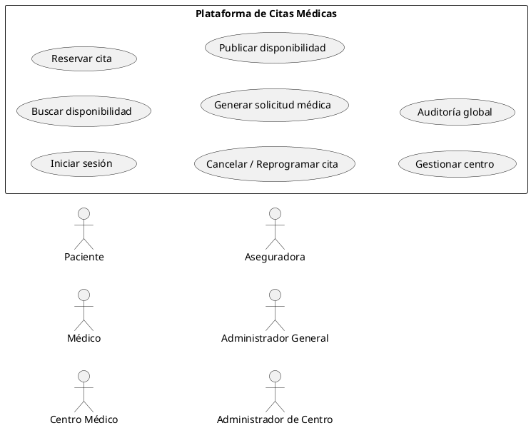
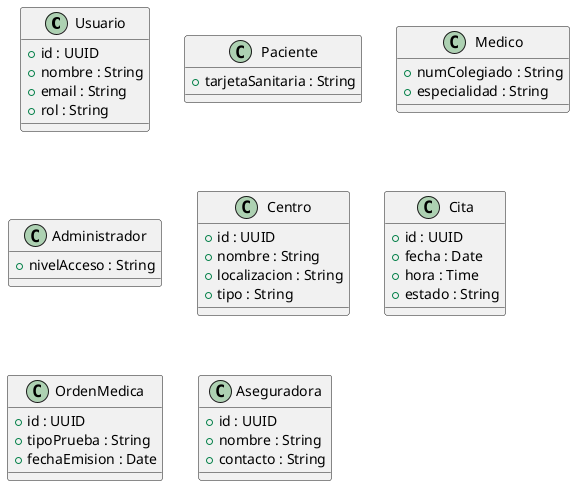
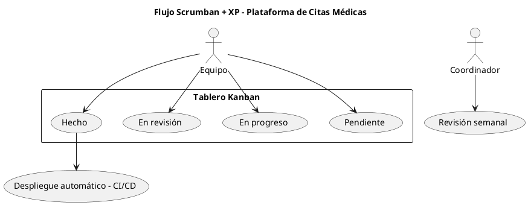
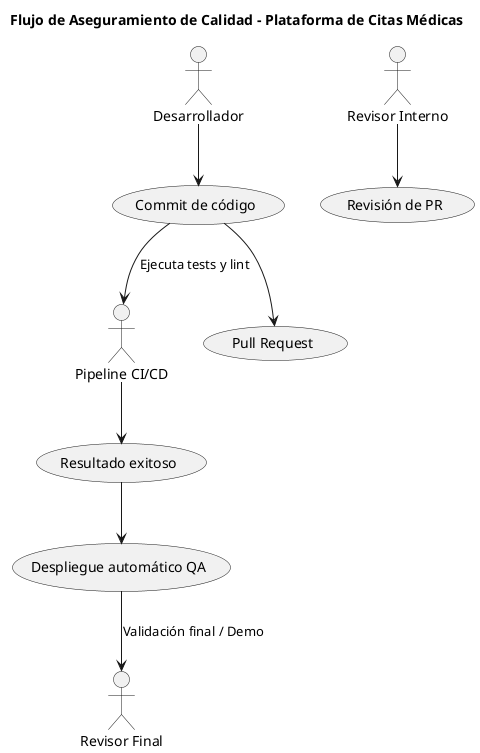

# 🏥 Plataforma de Citas Médicas

## 🧠 Contexto y motivación

En el sistema sanitario español, la gestión de citas para **pruebas médicas especializadas** (como resonancias magnéticas, análisis clínicos o ecografías) suele requerir que el paciente **contacte individualmente con cada hospital o centro médico**, ya sea **por teléfono o a través de portales web independientes**.

Este proceso es **ineficiente, repetitivo y poco transparente**:

* Los pacientes deben comparar manualmente la disponibilidad entre distintos hospitales.
* Los tiempos de espera suelen ser largos, llegando en muchos casos a **más de un mes**.
* Si finalmente se encuentra una cita más rápida, el paciente debe **cancelar la anterior** y reiniciar todo el proceso.

📌 **Motivación:**
Ante esta fragmentación, surge la necesidad de un **sistema unificado de gestión de citas médicas** que centralice la información de los centros adheridos a cada aseguradora o servicio público, permitiendo al paciente **elegir la opción más rápida y conveniente** desde una única plataforma.

---

## 🧩 Justificación desde la Ingeniería del Software

El desarrollo de este sistema requiere aplicar principios de **Ingeniería del Software** por varias razones:

* Implica **integración entre múltiples entidades** (hospitales, aseguradoras, centros privados, sistemas públicos).
* Maneja **datos sensibles** (información sanitaria personal protegida por el RGPD).
* Requiere **alta disponibilidad, fiabilidad y seguridad**, ya que afecta directamente a la atención médica.
* Necesita **planificación estructurada** para coordinar distintos equipos técnicos, APIs externas y fases de validación.

Por tanto, no se trata de una simple aplicación web, sino de un **proyecto de ingeniería multidisciplinar** que debe seguir un ciclo de vida bien definido, con control de calidad, métricas y gestión de riesgos.

---

## 🎯 Objetivos

### 🔸 Objetivo general

Desarrollar una **plataforma centralizada** que permita a los pacientes **consultar y reservar citas médicas o pruebas diagnósticas** en función de la **disponibilidad más rápida** ofrecida por hospitales y centros adheridos a su aseguradora o sistema público.

### 🔸 Objetivos específicos

* Integrar los **hospitales públicos, privados y aseguradoras** en una red común mediante APIs seguras.
* Permitir la **autenticación con tarjeta sanitaria o identificación digital**.
* Mostrar al paciente un listado de **centros disponibles ordenados por tiempo de espera**.
* Facilitar la **cancelación o modificación** de citas en tiempo real.
* Permitir la **gestión de agenda** para médicos y centros.
* Ofrecer herramientas estadísticas y de seguimiento para **autoridades sanitarias y aseguradoras**.

---

## 📦 Alcance del proyecto (versión inicial – MVP)

| Módulo                           | Descripción                                                                 |
| -------------------------------- | --------------------------------------------------------------------------- |
| **Autenticación**                | Acceso mediante número de tarjeta sanitaria o credenciales verificadas.     |
| **Búsqueda inteligente**         | Filtrado por tipo de prueba, localización y aseguradora.                    |
| **Reserva de cita**              | Selección de centro, fecha y confirmación inmediata.                        |
| **Cancelación y reprogramación** | Gestión autónoma por parte del paciente.                                    |
| **Gestión de centros médicos**   | Alta y administración de disponibilidad por parte de hospitales o clínicas. |
| **Notificaciones básicas**       | Confirmación o recordatorio de cita por correo electrónico.                 |

📘 *Quedan fuera del alcance inicial (v2):*

* Integración con historiales clínicos.
* Pago o facturación online.
* Chat médico o teleconsulta.
* Panel analítico avanzado.

---

## ⚠️ Riesgos identificados

| Categoría          | Riesgo                                                          | Mitigación                                              |
| ------------------ | --------------------------------------------------------------- | ------------------------------------------------------- |
| **Técnico**        | Fallos en la integración con APIs hospitalarias o aseguradoras. | Implementar servicios de fallback y colas de reintento. |
| **Seguridad**      | Exposición de datos personales o sanitarios.                    | Cifrado extremo a extremo y cumplimiento RGPD.          |
| **Disponibilidad** | Sobrecarga del sistema.                                         | Escalabilidad horizontal y balanceadores.               |
| **Gestión**        | Falta de coordinación entre entidades.                          | Protocolos de interoperabilidad.                        |
| **Usuarios**       | Baja adopción inicial.                                          | Campañas informativas y diseño centrado en el usuario.  |

---

## 🧮 Métricas iniciales de calidad (ISO/IEC 25010)

| Atributo           | Indicador                  | Meta     |
| ------------------ | -------------------------- | -------- |
| **Fiabilidad**     | Uptime del sistema         | ≥ 99,5 % |
| **Eficiencia**     | Tiempo medio de respuesta  | ≤ 2 s    |
| **Usabilidad**     | Éxito en reserva sin ayuda | ≥ 85 %   |
| **Mantenibilidad** | Cobertura de pruebas       | ≥ 80 %   |
| **Seguridad**      | Incidentes de datos        | 0        |

---

# 🧩 T2 – Ingeniería de Requisitos

## 👥 Actores del sistema

| Actor                              | Descripción                                       | Ejemplo de interacción                   |
| ---------------------------------- | ------------------------------------------------- | ---------------------------------------- |
| 🧍‍♂️ **Paciente**                 | Busca, reserva y cancela citas.                   | “Ver resonancia más próxima disponible”. |
| 🩺 **Médico / Especialista**       | Genera órdenes médicas y consulta disponibilidad. | “Solicitar prueba para un paciente”.     |
| 🏥 **Centro Médico / Hospital**    | Publica disponibilidad y confirma reservas.       | “Actualizar huecos libres”.              |
| 🧑‍💼 **Aseguradora**              | Define red de centros.                            | “Enviar lista de hospitales adheridos”.  |
| 👨‍💻 **Administrador general**    | Supervisa el sistema.                             | “Revisar logs y métricas”.               |
| 🏣 **Administrador de centro**     | Gestiona médicos y agenda.                        | “Alta de profesionales”.                 |
| 👩‍💻 **Administrador de usuario** | Soporte técnico a pacientes.                      | “Reinicio de credenciales”.              |

---

## ⚙️ Requisitos funcionales

| ID   | Descripción                                             |
| ---- | ------------------------------------------------------- |
| RF1  | Autenticación con tarjeta sanitaria o credenciales.     |
| RF2  | Generación de solicitudes médicas por parte del médico. |
| RF3  | Búsqueda de centros disponibles.                        |
| RF4  | Reserva, modificación o cancelación de citas.           |
| RF5  | Actualización de disponibilidad por centros.            |
| RF6  | Validación automática de coberturas.                    |
| RF7  | Gestión de agenda y personal médico.                    |
| RF8  | Auditorías y logs globales.                             |
| RF9  | Notificaciones automáticas.                             |
| RF10 | Registro seguro de acciones relevantes.                 |

---

## 🔒 Requisitos no funcionales

| Categoría                   | Descripción                                           |
| --------------------------- | ----------------------------------------------------- |
| **Rendimiento**             | Tiempo medio de respuesta < 2 s.                      |
| **Seguridad criptográfica** | TLS 1.3 + algoritmos poscuánticos (Kyber, Dilithium). |
| **Fiabilidad**              | Uptime ≥ 99,5 %.                                      |
| **Usabilidad**              | Interfaz web accesible (WCAG 2.1).                    |
| **Legalidad**               | Cumplimiento RGPD.                                    |

---

## 🧩 Diagrama de Casos de Uso (PlantUML)



---

## 🧮 Diagrama de Clases (PlantUML)



---

# 🧩 T3 – Metodologías de Desarrollo

## 🧠 Contexto

El sistema se desarrolla con una metodología **ágil híbrida: Scrumban + Extreme Programming (XP)**.
Combina la **flexibilidad de Kanban**, la **planificación ligera de Scrum** y las **buenas prácticas técnicas de XP** (TDD, CI/CD, refactorización).
Es perfecta para un equipo de **3 personas** y un plazo de **3 semanas**.

---

## 🔄 Flujo de trabajo Scrumban

El tablero se divide en columnas:

```
Pendiente → En progreso → En revisión → Hecho
```

### Revisión semanal

* Evaluar avances.
* Verificar ejecución de pruebas automáticas.
* Ajustar prioridades.

---

## 🧱 Arquitectura modular

```
📂 PlataformaCitasMedicas
 ├── backend/        → API REST (Node.js + Express)
 ├── frontend/       → Web (React + Vite)
 ├── docs/uml/       → Diagramas PlantUML
 └── .github/        → CI/CD y pruebas automatizadas
```

---

## 🧩 Diagrama de Flujo Scrumban + XP (PlantUML)



---

# 🧩 T4 – Calidad, Pruebas y Validación

## ⚙️ Estrategia de calidad

Tres pilares:

1. **Verificación:** cumplimiento técnico.
2. **Validación:** cumplimiento de requisitos.
3. **Aseguramiento continuo:** CI/CD automático y revisión semanal.

---

## 🧮 Fases de prueba

| Nivel           | Objetivo                           | Herramienta         |
| --------------- | ---------------------------------- | ------------------- |
| **Unitarias**   | Verificar funciones individuales.  | Jest / Vitest       |
| **Integración** | Probar comunicación entre módulos. | Supertest           |
| **Sistema**     | Validar todo el sistema.           | Scripts automáticos |
| **Aceptación**  | Revisión final del profesor.       | Demo funcional      |

---

## 🔐 Seguridad poscuántica

Uso de cifrados **Kyber / Dilithium** junto con TLS 1.3.
Hash Argon2 para contraseñas, logs cifrados y backups automáticos.

---

## 🧪 Integración continua y despliegue

* Pruebas automáticas (backend y frontend).
* Linter y build ejecutados en CI/CD.
* Despliegue automático a entorno QA (Render / Railway).
* Validación manual final del profesor.

---

## 📈 Diagrama PlantUML – Flujo de Aseguramiento de Calidad



---

## ✅ Enfoque final

* Automatización CI/CD completa.
* Seguridad poscuántica.
* Pruebas de rendimiento y regresión.
* Validación final externa.

---

## 📜 Licencia

MIT © 2025 
