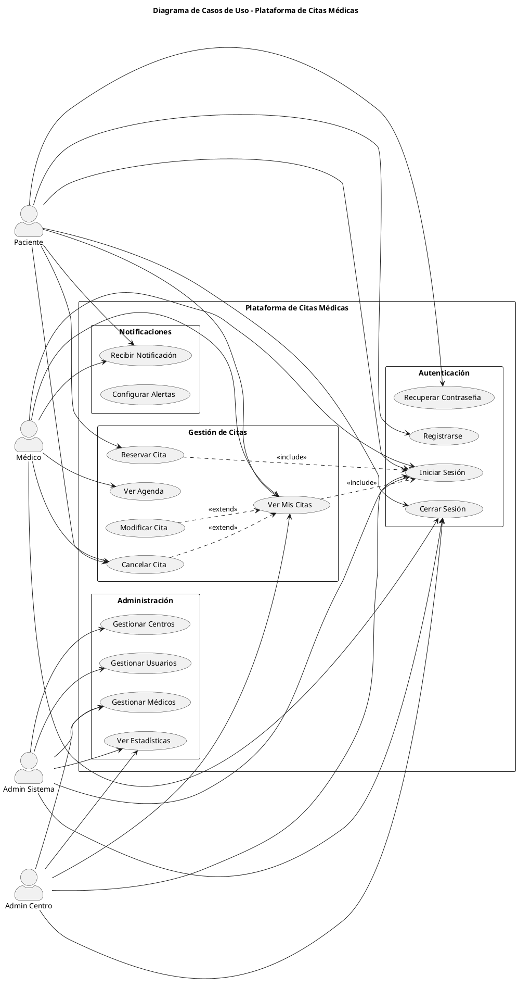
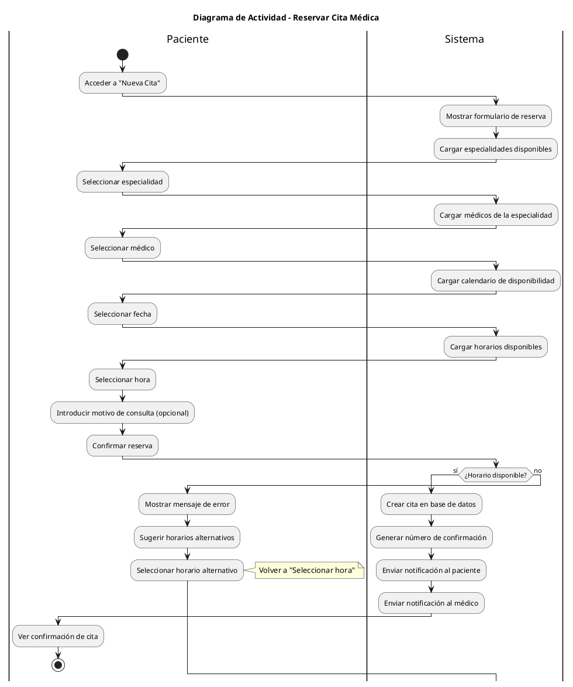
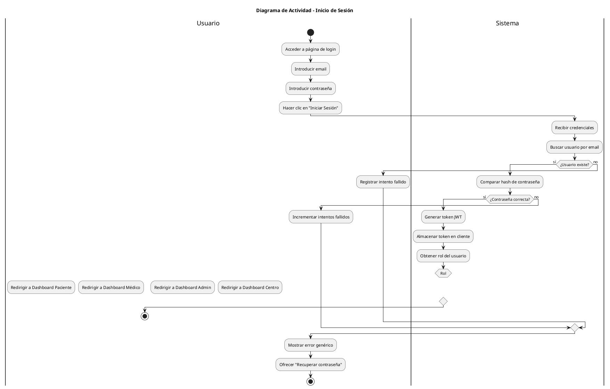
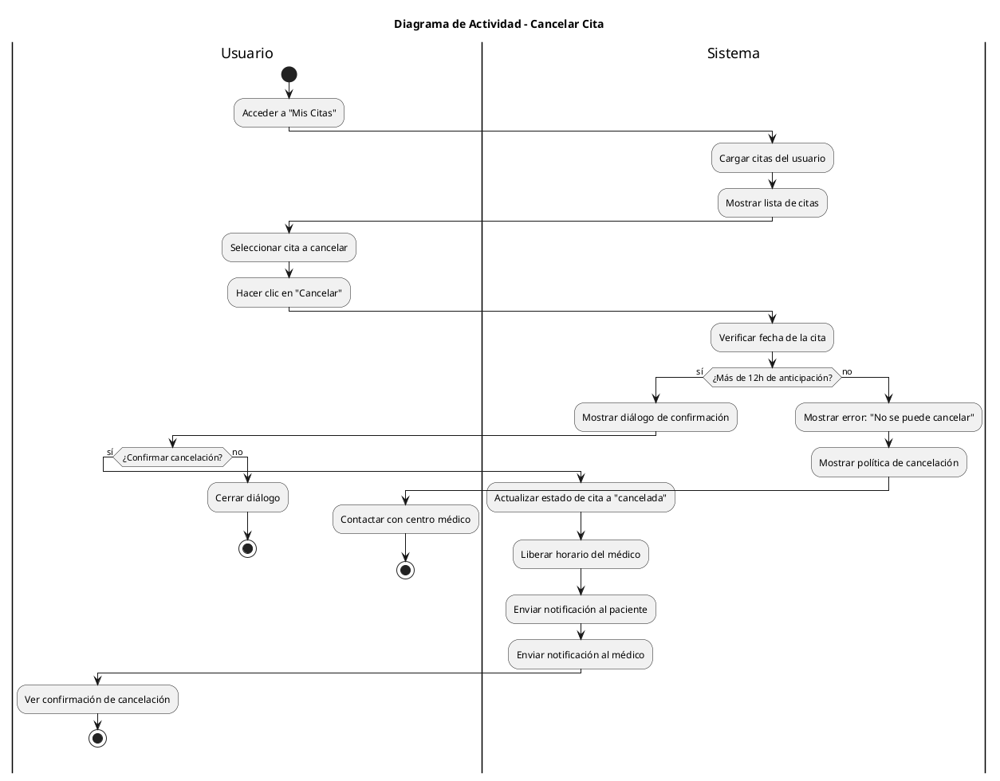
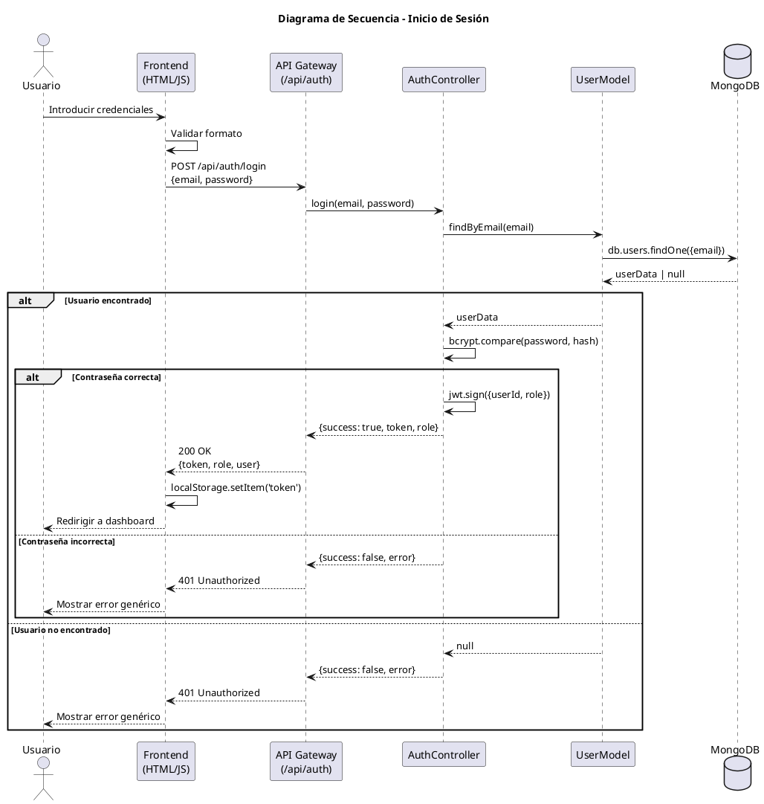
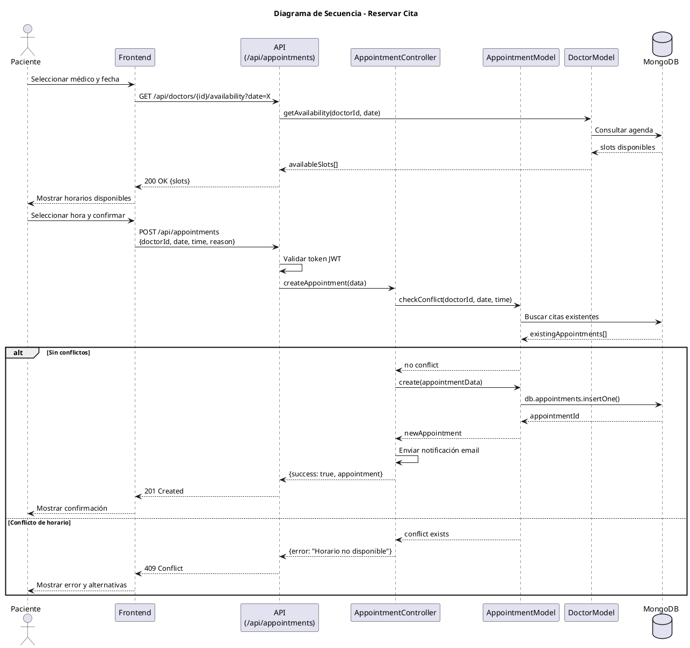
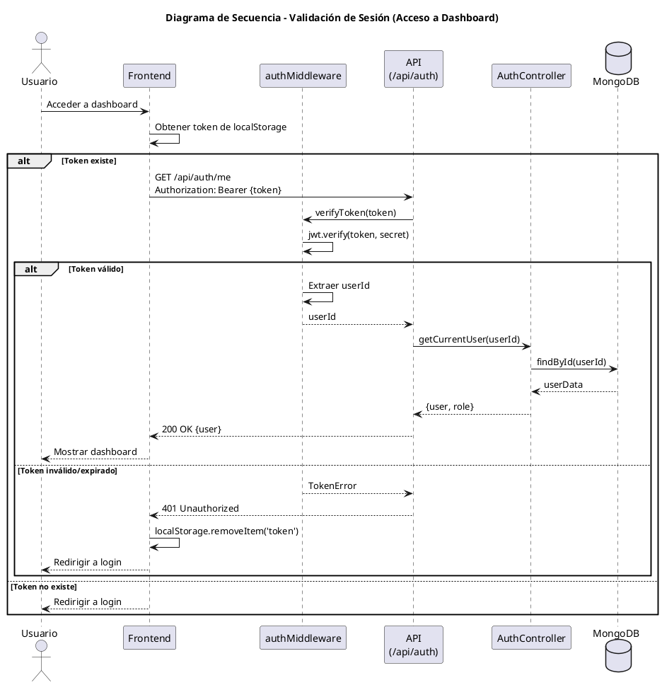
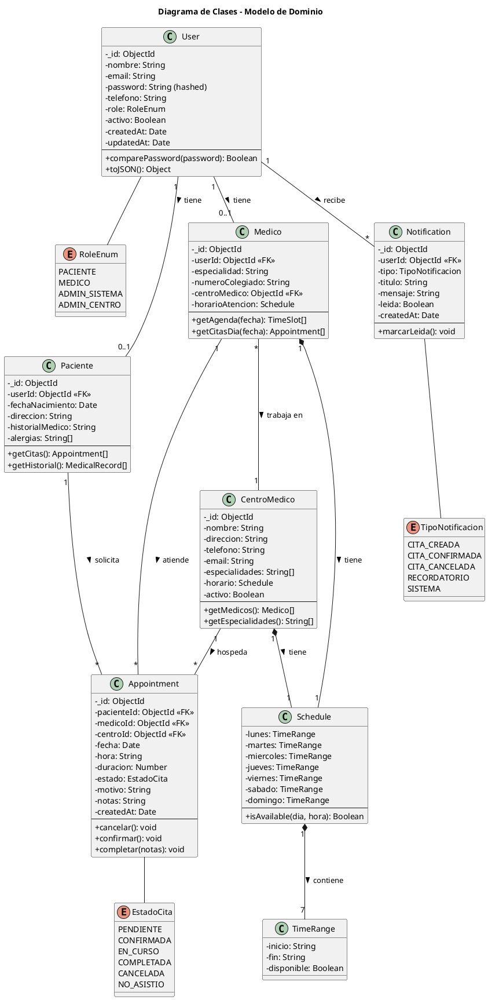
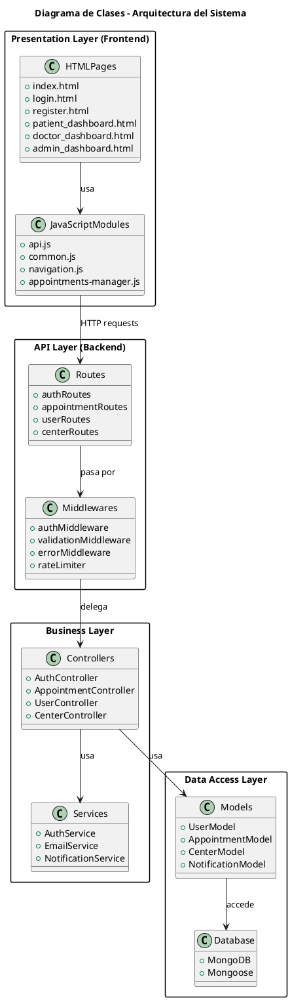

# 📐 Diagramas UML - Plataforma de Citas Médicas

**Versión:** 1.0  
**Fecha:** Noviembre 2025  
**Herramienta:** PlantUML

---

## 📑 Índice

1. [Introducción](#1-introducción)
2. [Diagrama de Casos de Uso](#2-diagrama-de-casos-de-uso)
3. [Diagrama de Actividad](#3-diagrama-de-actividad)
4. [Diagrama de Secuencia](#4-diagrama-de-secuencia)
5. [Diagrama de Clases](#5-diagrama-de-clases)
6. [Cómo Regenerar los Diagramas](#6-cómo-regenerar-los-diagramas)

---

## 1. Introducción

### 1.1 Propósito

Este documento contiene los diagramas UML del sistema, implementados usando PlantUML para facilitar su mantenimiento y versionado junto con el código fuente.

### 1.2 Herramientas

- **PlantUML:** Lenguaje de descripción de diagramas
- **Visualización:** VS Code + PlantUML extension, o servidor online

### 1.3 Convenciones

| Elemento | Notación |
|----------|----------|
| Actor | Figura humana |
| Caso de uso | Óvalo |
| Clase | Rectángulo con compartimentos |
| Relación | Línea con estereotipo |

---

## 2. Diagrama de Casos de Uso

### 2.1 Diagrama General del Sistema



### 2.2 Descripción de Casos de Uso

#### CU-001: Registrarse

| Campo | Descripción |
|-------|-------------|
| **ID** | CU-001 |
| **Nombre** | Registrarse |
| **Actor Principal** | Paciente |
| **Precondición** | El usuario no tiene cuenta |
| **Postcondición** | El usuario queda registrado en el sistema |
| **Flujo Principal** | 1. Usuario accede a formulario de registro<br>2. Usuario completa datos<br>3. Sistema valida datos<br>4. Sistema crea cuenta<br>5. Sistema confirma registro |
| **Flujo Alternativo** | 3a. Datos inválidos → Mostrar errores |

#### CU-002: Iniciar Sesión

| Campo | Descripción |
|-------|-------------|
| **ID** | CU-002 |
| **Nombre** | Iniciar Sesión |
| **Actor Principal** | Usuario registrado |
| **Precondición** | Usuario tiene cuenta activa |
| **Postcondición** | Usuario autenticado con sesión activa |
| **Flujo Principal** | 1. Usuario introduce credenciales<br>2. Sistema valida<br>3. Sistema genera token JWT<br>4. Sistema redirige a dashboard |
| **Flujo Alternativo** | 2a. Credenciales inválidas → Error genérico |

#### CU-003: Reservar Cita

| Campo | Descripción |
|-------|-------------|
| **ID** | CU-003 |
| **Nombre** | Reservar Cita |
| **Actor Principal** | Paciente |
| **Precondición** | Usuario autenticado como paciente |
| **Postcondición** | Cita creada en el sistema |
| **Flujo Principal** | 1. Paciente selecciona especialidad<br>2. Paciente selecciona médico<br>3. Paciente selecciona fecha/hora<br>4. Sistema valida disponibilidad<br>5. Sistema crea cita<br>6. Sistema notifica confirmación |
| **Flujo Alternativo** | 4a. Horario no disponible → Mostrar alternativas |

---

## 3. Diagrama de Actividad

### 3.1 Proceso de Reserva de Cita



### 3.2 Proceso de Autenticación



### 3.3 Proceso de Cancelación de Cita



---

## 4. Diagrama de Secuencia

### 4.1 Secuencia de Login



### 4.2 Secuencia de Reservar Cita



### 4.3 Secuencia de Validación de Sesión



---

## 5. Diagrama de Clases

### 5.1 Modelo de Dominio



### 5.2 Arquitectura de Capas



---

## 6. Cómo Regenerar los Diagramas

### 6.1 Requisitos

- **Java Runtime:** JRE 8 o superior
- **Graphviz:** Para diagramas de secuencia y actividad
- **PlantUML:** JAR o extensión de VS Code

### 6.2 Instalación

#### Opción A: VS Code Extension

```bash
# Instalar extensión PlantUML
# Buscar "PlantUML" en extensiones de VS Code
# ID: jebbs.plantuml
```

#### Opción B: Línea de comandos

```bash
# Instalar Java (si no está instalado)
sudo apt-get install default-jre

# Instalar Graphviz
sudo apt-get install graphviz

# Descargar PlantUML
wget https://sourceforge.net/projects/plantuml/files/plantuml.jar
```

### 6.3 Generar Diagramas

#### Desde VS Code

1. Abrir archivo `.puml` o bloque de código PlantUML
2. Usar `Alt+D` para preview
3. Usar `Ctrl+Shift+P` → "PlantUML: Export Current Diagram"

#### Desde línea de comandos

```bash
# Generar PNG
java -jar plantuml.jar diagrama.puml

# Generar SVG
java -jar plantuml.jar -tsvg diagrama.puml

# Generar todos los diagramas de una carpeta
java -jar plantuml.jar -tpng docs/uml/
```

### 6.4 Servidor Online

También se pueden visualizar en:
- **PlantUML Web Server:** http://www.plantuml.com/plantuml
- **PlantText:** https://www.planttext.com/

### 6.5 Integración con CI/CD

```yaml
# Ejemplo para GitHub Actions
- name: Generate UML Diagrams
  run: |
    sudo apt-get install -y graphviz
    wget -q https://sourceforge.net/projects/plantuml/files/plantuml.jar
    java -jar plantuml.jar -tpng docs/uml/*.puml
```

---

## Historial de Cambios

| Versión | Fecha | Autor | Cambios |
|---------|-------|-------|---------|
| 1.0 | Nov 2025 | Equipo | Versión inicial con todos los diagramas |

---

**Documentos relacionados:**
- [01_REQUISITOS.md](01_REQUISITOS.md) - Requisitos del sistema
- [03_ARQUITECTURA.md](03_ARQUITECTURA.md) - Arquitectura del sistema
