# Diagramas UML

## Plataforma de Citas Médicas

---

## Índice

1. [Introducción](#1-introducción)
2. [Diagrama de Casos de Uso](#2-diagrama-de-casos-de-uso)
3. [Diagrama de Clases](#3-diagrama-de-clases)
4. [Diagramas de Secuencia](#4-diagramas-de-secuencia)
5. [Diagrama de Estados](#5-diagrama-de-estados)
6. [Diagrama de Actividades](#6-diagrama-de-actividades)
7. [Diagrama de Componentes](#7-diagrama-de-componentes)
8. [Diagrama de Despliegue](#8-diagrama-de-despliegue)
9. [Trazabilidad UML-Requisitos](#9-trazabilidad-uml-requisitos)

---

## 1. Introducción

### 1.1 Propósito

Este documento contiene todos los diagramas UML que modelan la Plataforma de Citas Médicas. Los diagramas siguen el estándar UML 2.5 y están implementados usando PlantUML.

**Issues relacionados:** #5, #6, #7, #8, #9

### 1.2 Notación

| Símbolo | Significado |
|---|---|
| `<<actor>>` | Usuario del sistema |
| `<<boundary>>` | Interfaz de usuario |
| `<<control>>` | Lógica de negocio |
| `<<entity>>` | Datos persistentes |

### 1.3 Herramientas

- PlantUML para generación de diagramas
- Visualización: extensiones VS Code, PlantUML Server

---

## 2. Diagrama de Casos de Uso

### 2.1 Casos de Uso General del Sistema

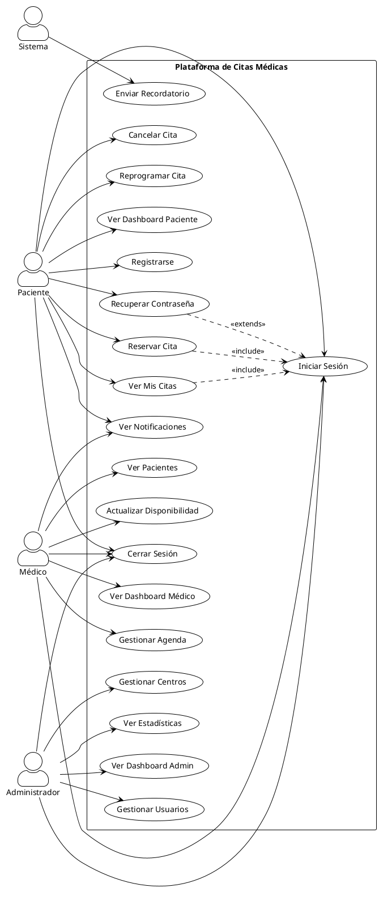

### 2.2 Casos de Uso - Módulo de Autenticación

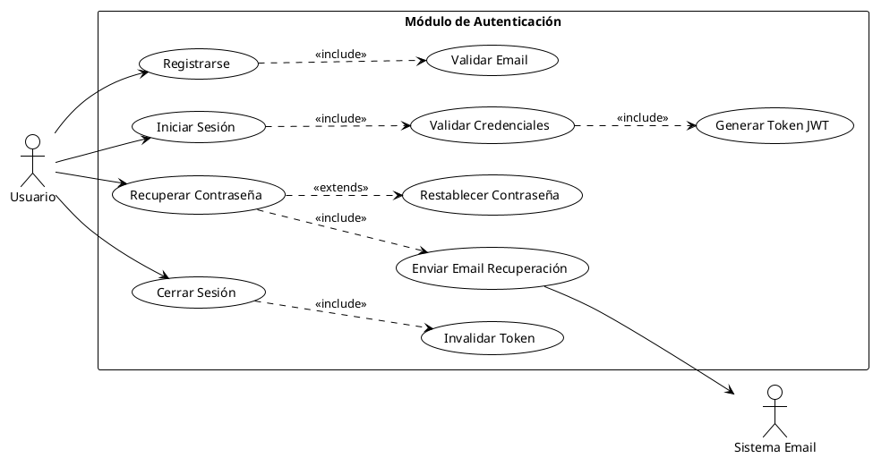

### 2.3 Casos de Uso - Módulo de Citas

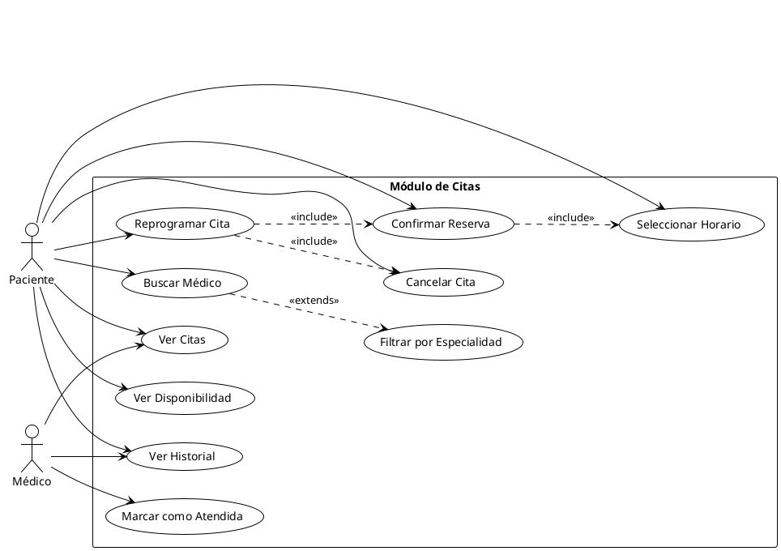

---

## 3. Diagrama de Clases

### 3.1 Modelo de Dominio Completo

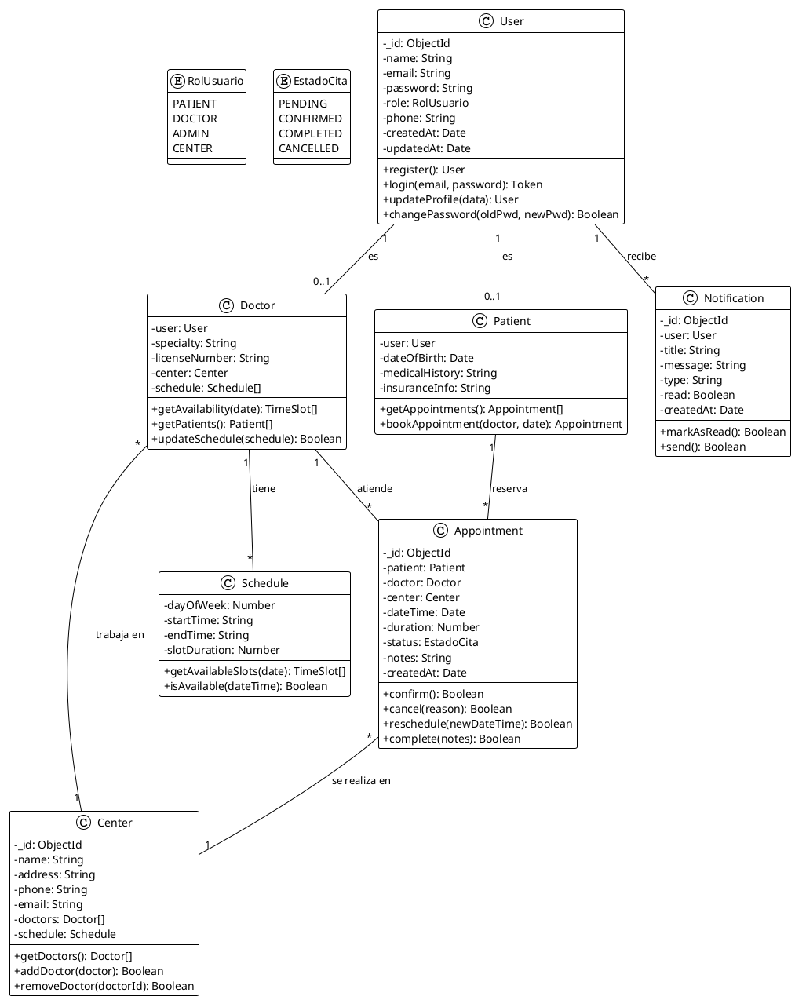

### 3.2 Diagrama de Clases - Capa de Controladores

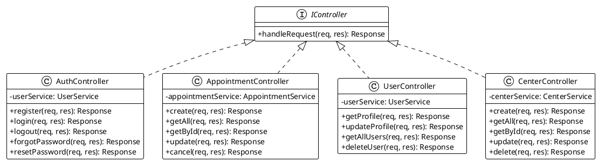

### 3.3 Diagrama de Clases - Capa de Servicios

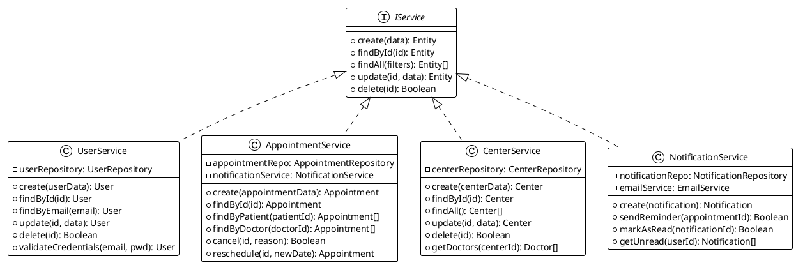

---

## 4. Diagramas de Secuencia

### 4.1 Secuencia - Inicio de Sesión

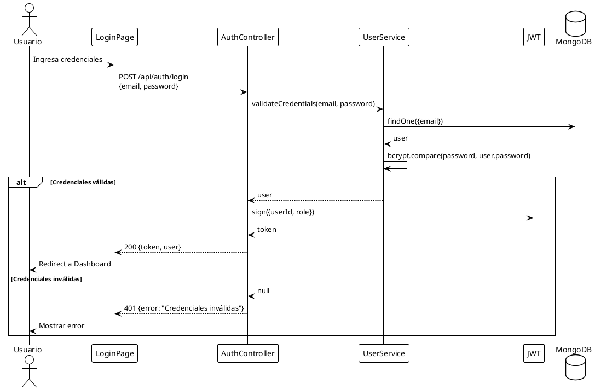

### 4.2 Secuencia - Reservar Cita

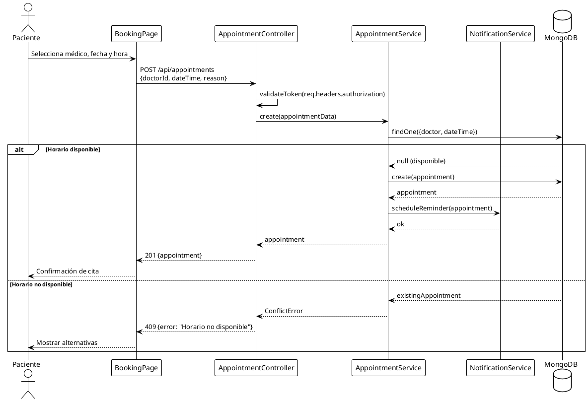

### 4.3 Secuencia - Cancelar Cita

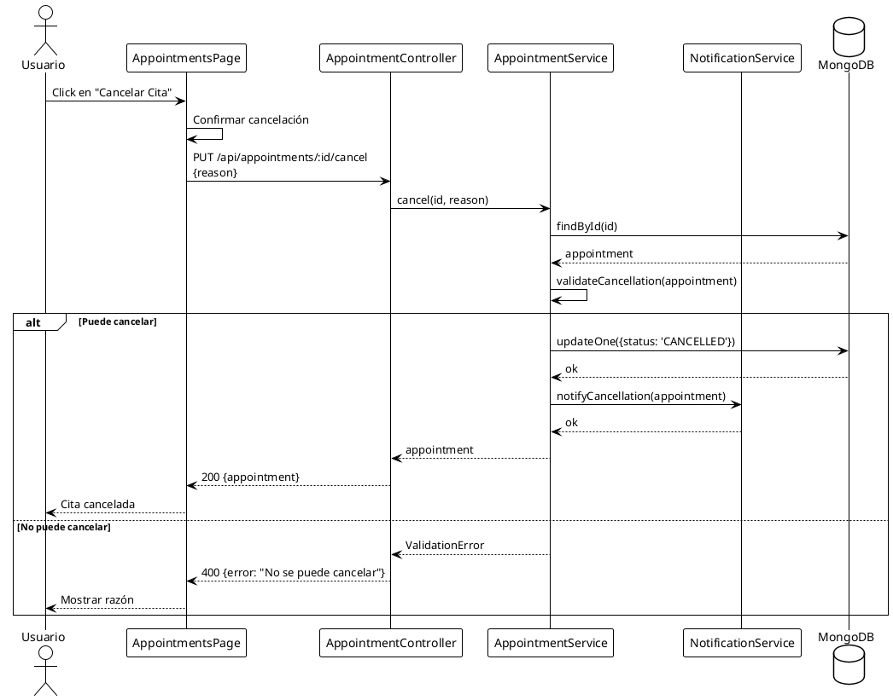

### 4.4 Secuencia - Registro de Usuario

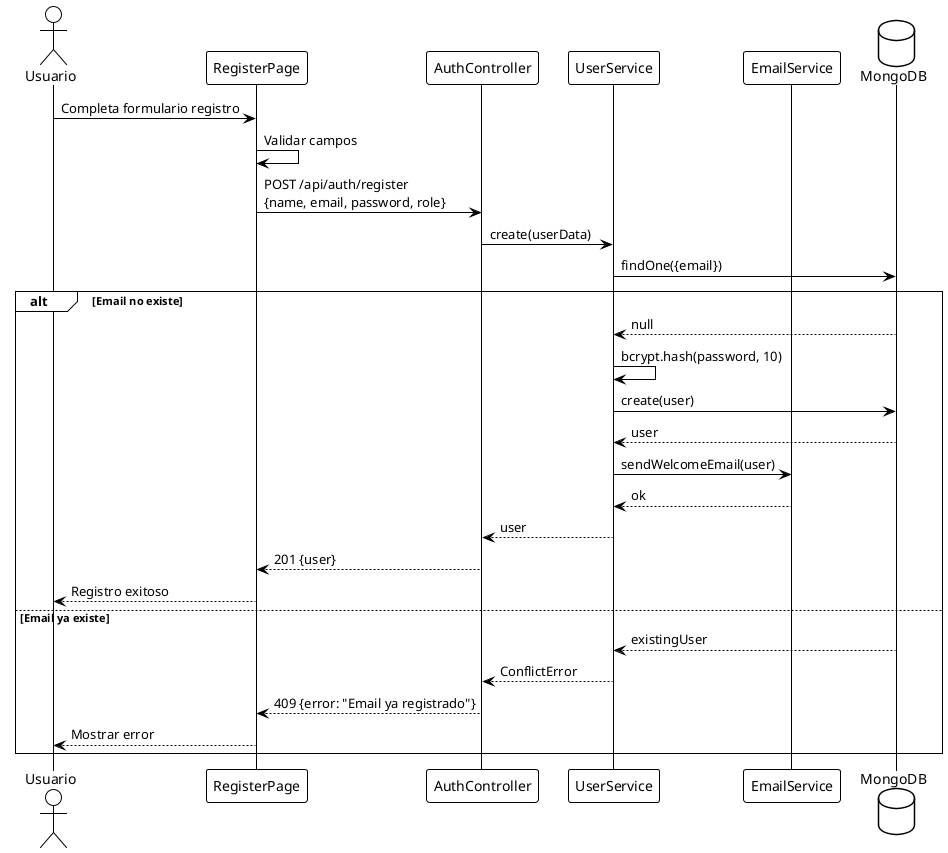

---

## 5. Diagrama de Estados

### 5.1 Estados de una Cita

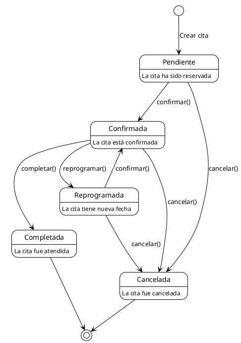

### 5.2 Estados de un Usuario

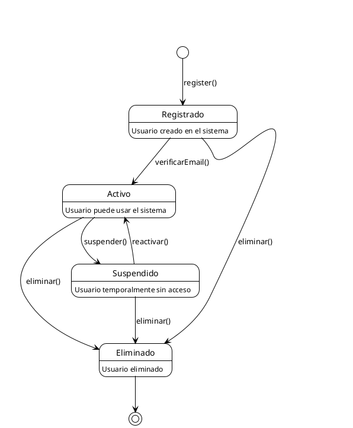

### 5.3 Estados de Autenticación

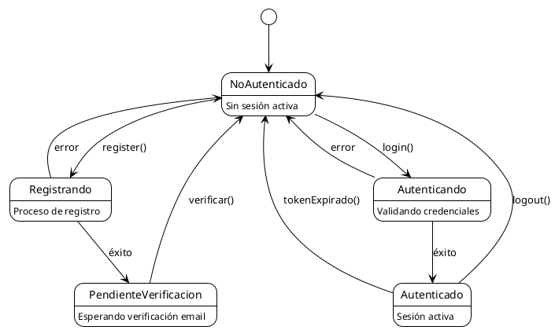

---

## 6. Diagrama de Actividades

### 6.1 Actividad - Proceso de Reserva de Cita

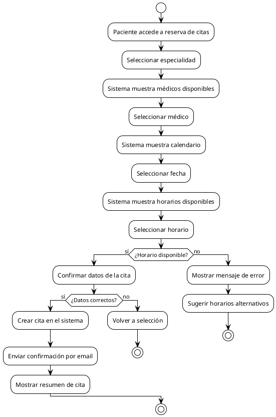

### 6.2 Actividad - Proceso de Autenticación

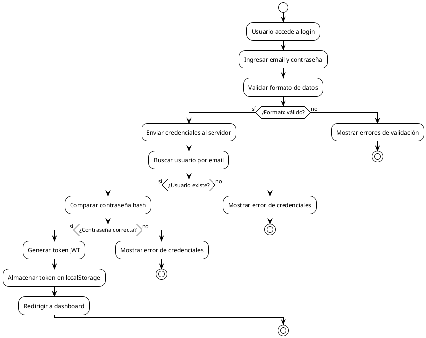

---

## 7. Diagrama de Componentes

### 7.1 Arquitectura de Componentes

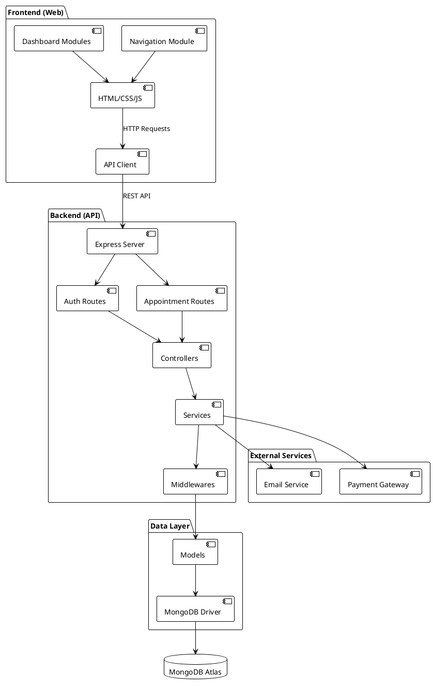

### 7.2 Componentes del Frontend

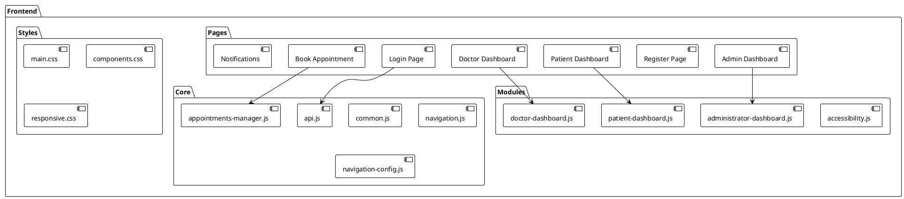

---

## 8. Diagrama de Despliegue

### 8.1 Infraestructura de Despliegue

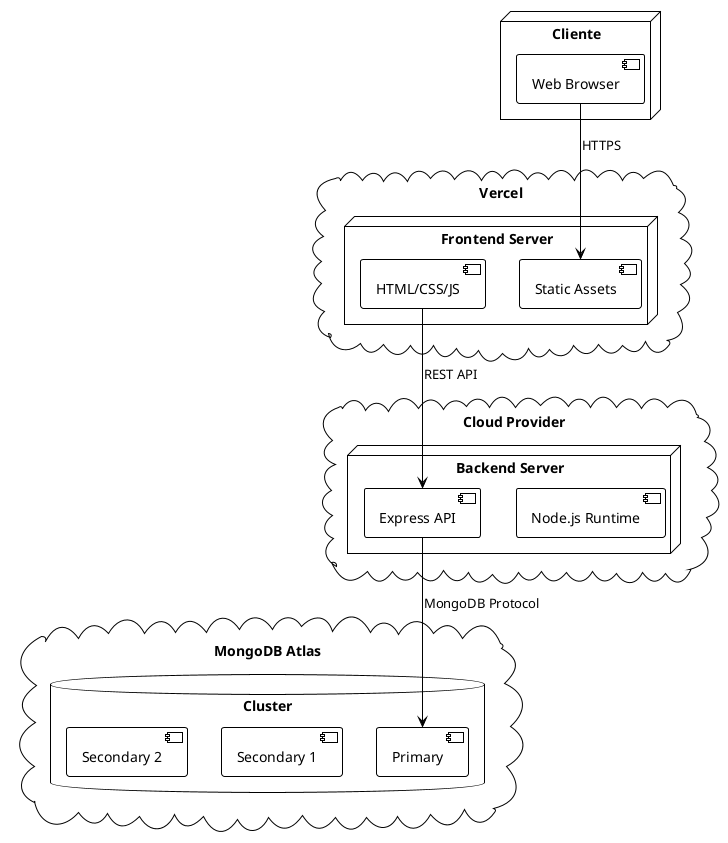

### 8.2 Configuración de Entornos

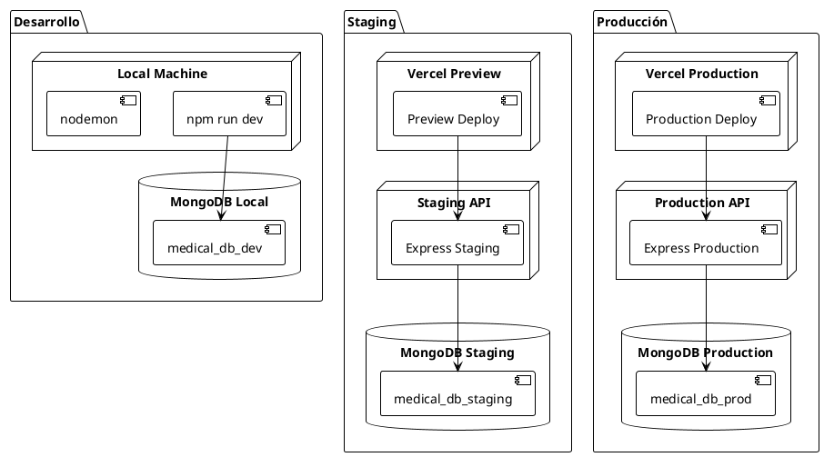

---

## 9. Trazabilidad UML-Requisitos

### 9.1 Matriz de Trazabilidad

| Diagrama | Requisitos Cubiertos | Issues |
|---|---|---|
| CU General | RF-001 a RF-032 | #5, #6, #7, #8, #9 |
| Clases Dominio | RF-001 a RF-032, RNF-014 | #5, #6, #7, #8 |
| Seq Login | RF-002, RF-004 | #5 |
| Seq Reserva | RF-007 a RF-012 | #7, #8 |
| Estados Cita | RF-007, RF-009, RF-010 | #7, #8 |
| Componentes | RNF-014 | #18, #19 |
| Despliegue | RNF-013 a RNF-016 | #20, #21 |

### 9.2 Cobertura de Requisitos

| Tipo | Total | Cubiertos | % Cobertura |
|---|---|---|---|
| Funcionales | 32 | 32 | 100% |
| No Funcionales | 21 | 18 | 86% |
| Casos de Uso | 19 | 19 | 100% |

---

## Historial de Versiones

| Versión | Fecha | Autor | Cambios |
|---|---|---|---|
| 1.0 | 2024-XX-XX | David | Versión inicial |

---

*Diagramas generados con PlantUML - https://plantuml.com*
