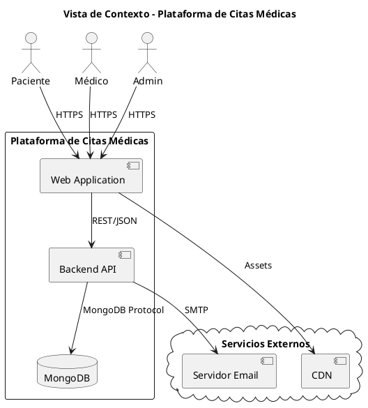
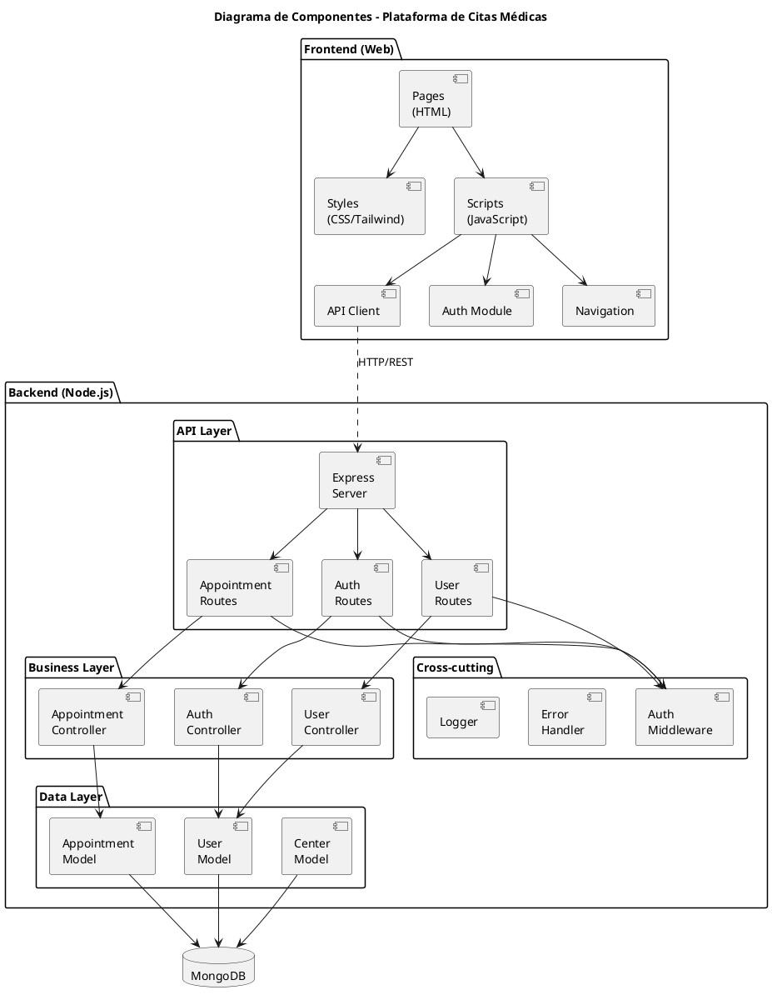
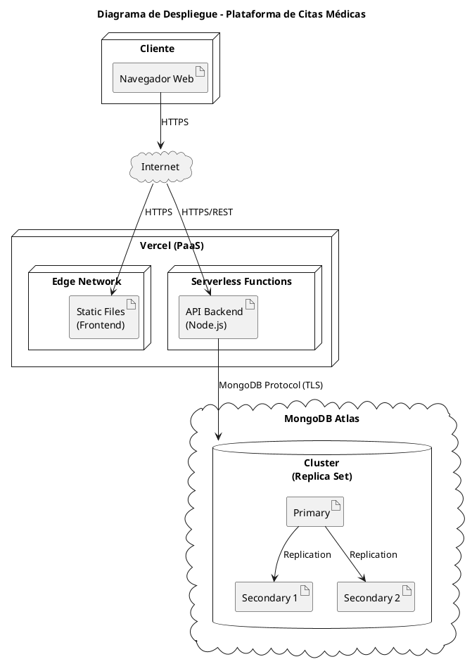

# 🏗️ Documento de Arquitectura - Plataforma de Citas Médicas

**Versión:** 1.0  
**Fecha:** Noviembre 2025  
**Estado:** Activo

---

## 📑 Índice

1. [Introducción](#1-introducción)
2. [Vista de Contexto](#2-vista-de-contexto)
3. [Decisiones Arquitectónicas](#3-decisiones-arquitectónicas)
4. [Patrones de Diseño](#4-patrones-de-diseño)
5. [Arquitectura de Componentes](#5-arquitectura-de-componentes)
6. [Arquitectura de Despliegue](#6-arquitectura-de-despliegue)
7. [Seguridad](#7-seguridad)
8. [Calidad y Atributos](#8-calidad-y-atributos)

---

## 1. Introducción

### 1.1 Propósito

Este documento describe la arquitectura de software de la Plataforma de Citas Médicas, incluyendo las decisiones de diseño, patrones aplicados y estructura de componentes.

### 1.2 Alcance

El documento cubre:
- Arquitectura de alto nivel del sistema
- Componentes principales y sus interacciones
- Patrones de diseño aplicados
- Infraestructura de despliegue

### 1.3 Stakeholders

| Rol | Interés |
|-----|---------|
| Desarrolladores | Implementación y mantenimiento |
| Arquitecto | Decisiones técnicas |
| QA | Testing y validación |
| DevOps | Despliegue y operaciones |

---

## 2. Vista de Contexto

### 2.1 Diagrama de Contexto



### 2.2 Actores del Sistema

| Actor | Descripción | Interacciones |
|-------|-------------|---------------|
| Paciente | Usuario que solicita citas médicas | Registro, login, reservar citas, ver historial |
| Médico | Profesional de salud | Login, ver agenda, gestionar citas |
| Admin Sistema | Administrador global | Gestión de usuarios, configuración |
| Admin Centro | Administrador de centro | Gestión de médicos del centro |

### 2.3 Sistemas Externos

| Sistema | Propósito | Protocolo |
|---------|-----------|-----------|
| MongoDB Atlas | Persistencia de datos | MongoDB Wire Protocol |
| Servidor SMTP | Envío de notificaciones | SMTP/TLS |
| CDN (opcional) | Distribución de assets | HTTPS |

---

## 3. Decisiones Arquitectónicas

### 3.1 ADR-001: Arquitectura Monolítica

| Aspecto | Decisión |
|---------|----------|
| **Contexto** | Proyecto académico con equipo pequeño y tiempo limitado |
| **Decisión** | Arquitectura monolítica con separación de capas |
| **Justificación** | Simplicidad de desarrollo y despliegue |
| **Consecuencias** | (+) Menor complejidad, (-) Escalabilidad limitada |
| **Estado** | Aceptada |

### 3.2 ADR-002: API REST con Express.js

| Aspecto | Decisión |
|---------|----------|
| **Contexto** | Necesidad de API para comunicación frontend-backend |
| **Decisión** | REST API con Node.js y Express.js |
| **Justificación** | Madurez del ecosistema, conocimiento del equipo, rendimiento |
| **Consecuencias** | (+) Amplia documentación, (+) NPM ecosystem |
| **Estado** | Aceptada |

### 3.3 ADR-003: MongoDB como Base de Datos

| Aspecto | Decisión |
|---------|----------|
| **Contexto** | Modelo de datos flexible, datos semi-estructurados |
| **Decisión** | MongoDB con Mongoose ODM |
| **Justificación** | Flexibilidad de esquema, escalabilidad horizontal |
| **Consecuencias** | (+) Schema flexible, (+) JSON nativo, (-) No relacional |
| **Estado** | Aceptada |

### 3.4 ADR-004: Autenticación JWT

| Aspecto | Decisión |
|---------|----------|
| **Contexto** | Necesidad de autenticación stateless |
| **Decisión** | JWT (JSON Web Tokens) con expiración |
| **Justificación** | Stateless, escalable, estándar de la industria |
| **Consecuencias** | (+) Escalable, (+) Portable, (-) Revocación compleja |
| **Estado** | Aceptada |

### 3.5 ADR-005: Frontend Vanilla JavaScript

| Aspecto | Decisión |
|---------|----------|
| **Contexto** | Interfaces web modernas sin framework pesado |
| **Decisión** | HTML5 + CSS3 + JavaScript ES6+ + Tailwind CSS |
| **Justificación** | Simplicidad, rendimiento, sin dependencias de framework |
| **Consecuencias** | (+) Ligero, (+) Sin build complejo, (-) Más código manual |
| **Estado** | Aceptada |

---

## 4. Patrones de Diseño

### 4.1 Patrones Arquitectónicos

#### 4.1.1 Modelo-Vista-Controlador (MVC)

```
┌─────────────────────────────────────────────────────────┐
│                      FRONTEND                           │
│  ┌─────────┐    ┌─────────┐    ┌─────────┐            │
│  │  View   │ ←→ │  Model  │    │Controller│            │
│  │ (HTML)  │    │  (JS)   │    │  (JS)   │            │
│  └─────────┘    └─────────┘    └─────────┘            │
└─────────────────────────────────────────────────────────┘
                          ↕ HTTP/REST
┌─────────────────────────────────────────────────────────┐
│                      BACKEND                            │
│  ┌─────────┐    ┌─────────┐    ┌─────────┐            │
│  │ Routes  │ → │Controller│ → │  Model  │            │
│  │         │    │         │    │(Mongoose)│            │
│  └─────────┘    └─────────┘    └─────────┘            │
└─────────────────────────────────────────────────────────┘
```

**Aplicación en el proyecto:**

| Componente | Implementación |
|------------|----------------|
| Model | `backend/src/models/*.js` |
| View | `web/*.html`, `web/js/*` |
| Controller | `backend/src/controllers/*.js` |
| Routes | `backend/src/routes/*.js` |

#### 4.1.2 Repository Pattern

```javascript
// Ejemplo conceptual - Separación de acceso a datos
class UserRepository {
    async findById(id) { /* ... */ }
    async findByEmail(email) { /* ... */ }
    async create(userData) { /* ... */ }
    async update(id, data) { /* ... */ }
    async delete(id) { /* ... */ }
}
```

#### 4.1.3 Middleware Pattern

```
Request → [Middleware1] → [Middleware2] → [Controller] → Response
             ↓                ↓
          Logging         Auth Check
```

**Middlewares implementados:**

| Middleware | Propósito |
|------------|-----------|
| `authMiddleware` | Validación de JWT |
| `roleMiddleware` | Verificación de permisos |
| `rateLimiter` | Protección contra DDoS |
| `errorHandler` | Manejo centralizado de errores |

### 4.2 Patrones de Diseño

#### 4.2.1 Singleton

**Uso:** Conexión a base de datos

```javascript
// Conexión única a MongoDB
class Database {
    static instance = null;
    
    static getInstance() {
        if (!Database.instance) {
            Database.instance = mongoose.connect(uri);
        }
        return Database.instance;
    }
}
```

#### 4.2.2 Factory

**Uso:** Creación de respuestas API

```javascript
// Factory de respuestas
const ResponseFactory = {
    success: (data) => ({ success: true, data }),
    error: (message, code) => ({ success: false, error: message, code }),
    paginated: (data, page, total) => ({ success: true, data, page, total })
};
```

#### 4.2.3 Strategy

**Uso:** Diferentes estrategias de autenticación

```javascript
// Estrategias de autenticación
const authStrategies = {
    jwt: (req) => verifyJWT(req.headers.authorization),
    apiKey: (req) => verifyApiKey(req.headers['x-api-key']),
    session: (req) => verifySession(req.session)
};
```

---

## 5. Arquitectura de Componentes

### 5.1 Diagrama de Componentes



### 5.2 Componentes Frontend

| Componente | Archivo(s) | Responsabilidad |
|------------|------------|-----------------|
| API Client | `web/js/api.js` | Comunicación con backend |
| Auth Module | `web/js/api.js` | Gestión de autenticación |
| Navigation | `web/js/navigation.js` | Control de navegación |
| Pages | `web/*.html` | Interfaces de usuario |
| Styles | `web/css/*` | Estilos y temas |

### 5.3 Componentes Backend

| Componente | Archivo(s) | Responsabilidad |
|------------|------------|-----------------|
| Server | `src/server.js` | Punto de entrada |
| Auth Routes | `src/routes/auth.js` | Endpoints de autenticación |
| Auth Controller | `src/controllers/auth.js` | Lógica de autenticación |
| User Model | `src/models/User.js` | Modelo de usuario |
| Auth Middleware | `src/middlewares/auth.js` | Validación de tokens |

### 5.4 Interfaces entre Componentes

#### API REST Endpoints

| Método | Endpoint | Descripción |
|--------|----------|-------------|
| POST | `/api/auth/register` | Registro de usuario |
| POST | `/api/auth/login` | Inicio de sesión |
| GET | `/api/auth/me` | Usuario actual |
| GET | `/api/appointments` | Listar citas |
| POST | `/api/appointments` | Crear cita |
| DELETE | `/api/appointments/:id` | Cancelar cita |

---

## 6. Arquitectura de Despliegue

### 6.1 Diagrama de Despliegue



### 6.2 Entornos

| Entorno | Propósito | URL |
|---------|-----------|-----|
| Desarrollo | Desarrollo local | `localhost:3000` |
| Staging | Pruebas pre-producción | `staging.example.com` |
| Producción | Usuarios finales | `app.example.com` |

### 6.3 Configuración de Entornos

#### Desarrollo
```env
NODE_ENV=development
PORT=3000
MONGODB_URI=mongodb://localhost:27017/medical-dev
JWT_SECRET=dev-secret-key
```

#### Producción
```env
NODE_ENV=production
PORT=3000
MONGODB_URI=mongodb+srv://...
JWT_SECRET=<secure-random-key>
```

### 6.4 Infraestructura como Código

#### vercel.json
```json
{
  "version": 2,
  "builds": [
    { "src": "backend/src/server.js", "use": "@vercel/node" },
    { "src": "web/**", "use": "@vercel/static" }
  ],
  "routes": [
    { "src": "/api/(.*)", "dest": "backend/src/server.js" },
    { "src": "/(.*)", "dest": "web/$1" }
  ]
}
```

---

## 7. Seguridad

### 7.1 Arquitectura de Seguridad

```
┌─────────────────────────────────────────────────────────┐
│                    CAPA DE SEGURIDAD                     │
├─────────────────────────────────────────────────────────┤
│  ┌──────────┐  ┌──────────┐  ┌──────────┐  ┌─────────┐ │
│  │  HTTPS   │  │  CORS    │  │  Helmet  │  │  Rate   │ │
│  │  (TLS)   │  │  Policy  │  │  Headers │  │ Limiter │ │
│  └──────────┘  └──────────┘  └──────────┘  └─────────┘ │
├─────────────────────────────────────────────────────────┤
│                    AUTENTICACIÓN                         │
│  ┌──────────────────────────────────────────────────┐   │
│  │     JWT Token + Bcrypt Password Hashing          │   │
│  └──────────────────────────────────────────────────┘   │
├─────────────────────────────────────────────────────────┤
│                    AUTORIZACIÓN                          │
│  ┌──────────┐  ┌──────────┐  ┌──────────┐              │
│  │  Role    │  │ Resource │  │  Action  │              │
│  │  Based   │  │  Owner   │  │  Based   │              │
│  └──────────┘  └──────────┘  └──────────┘              │
└─────────────────────────────────────────────────────────┘
```

### 7.2 Controles de Seguridad

| Control | Implementación | Estado |
|---------|----------------|--------|
| HTTPS | TLS 1.2+ en producción | ✅ |
| CORS | Whitelist de orígenes | ✅ |
| Helmet | Headers de seguridad | ✅ |
| Rate Limiting | 100 req/15min | ✅ |
| JWT | Tokens con expiración | ✅ |
| Bcrypt | Hash de contraseñas | ✅ |
| XSS Protection | Sanitización de inputs | 🔄 Parcial |
| CSRF | Tokens CSRF | ⏳ Pendiente |
| SQL Injection | Uso de ODM (Mongoose) | ✅ |

### 7.3 Flujo de Autenticación

```
1. Usuario envía credenciales
2. Backend valida contra hash bcrypt
3. Si es válido, genera JWT con:
   - userId
   - role
   - exp (expiración)
4. Cliente almacena token en localStorage
5. Cada request incluye: Authorization: Bearer <token>
6. Middleware valida token en cada request protegida
```

---

## 8. Calidad y Atributos

### 8.1 Atributos de Calidad

| Atributo | Descripción | Métrica | Estado |
|----------|-------------|---------|--------|
| **Rendimiento** | Tiempo de respuesta | < 500ms | ✅ |
| **Disponibilidad** | Uptime | > 99% | ✅ |
| **Escalabilidad** | Usuarios concurrentes | 100+ | 🔄 |
| **Seguridad** | Vulnerabilidades | 0 críticas | ✅ |
| **Mantenibilidad** | Complejidad ciclomática | < 10 | 🔄 |
| **Testeabilidad** | Cobertura de tests | > 70% | ⏳ |

### 8.2 Tácticas Arquitectónicas

#### Para Rendimiento
- Indexación de base de datos
- Caching de consultas frecuentes
- Compresión de respuestas (gzip)
- Lazy loading en frontend

#### Para Disponibilidad
- Replica Set de MongoDB
- Health checks
- Graceful shutdown
- Manejo de errores centralizado

#### Para Seguridad
- Autenticación JWT
- Autorización basada en roles
- Sanitización de inputs
- Headers de seguridad (Helmet)

#### Para Mantenibilidad
- Separación de capas
- Código documentado
- Configuración externalizada
- Logs estructurados

---

## Historial de Cambios

| Versión | Fecha | Autor | Cambios |
|---------|-------|-------|---------|
| 1.0 | Nov 2025 | Equipo | Versión inicial |

---

**Documentos relacionados:**
- [01_REQUISITOS.md](01_REQUISITOS.md) - Requisitos del sistema
- [02_UML.md](02_UML.md) - Diagramas UML
- [05_CI_CD.md](05_CI_CD.md) - Integración y despliegue continuo
