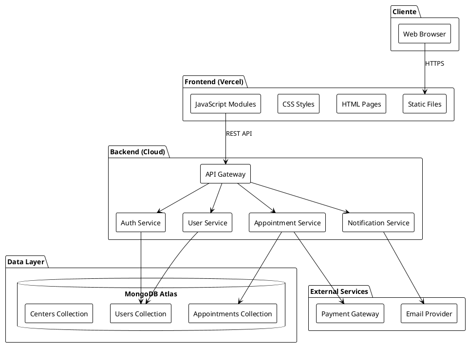
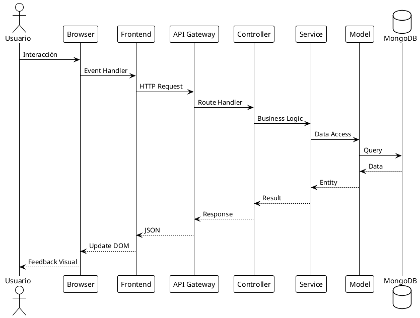
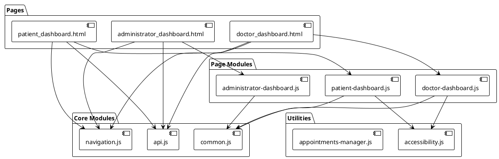
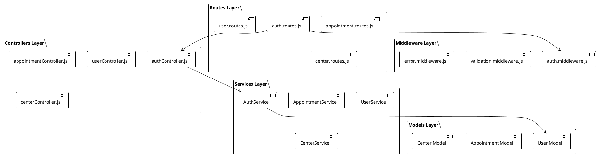
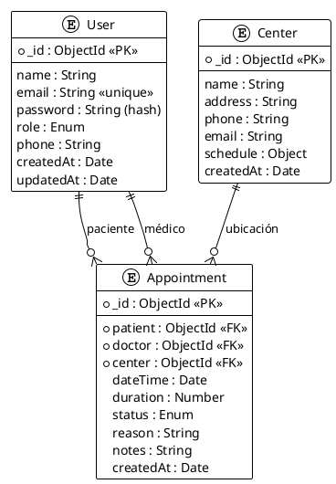
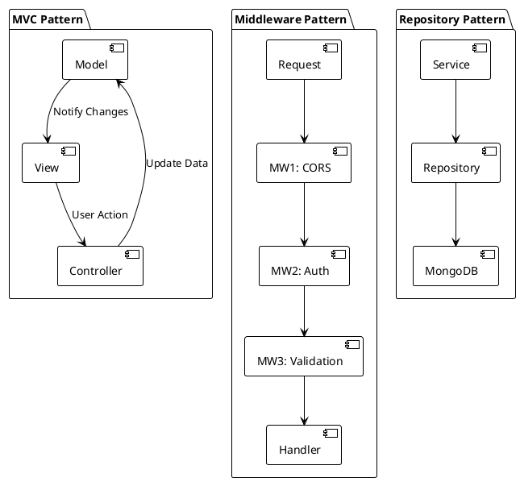
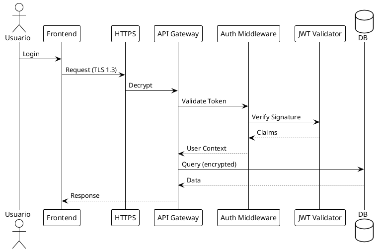
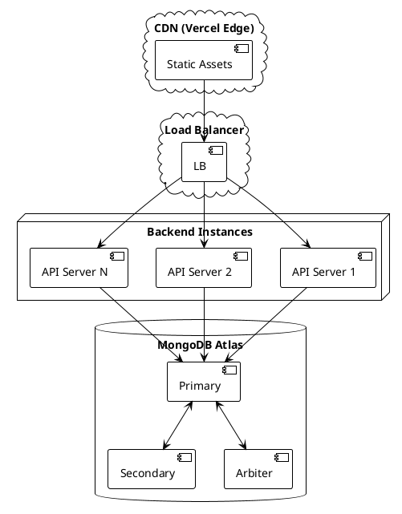

# Arquitectura del Sistema

## Plataforma de Citas Médicas

---

## Índice

1. [Introducción](#1-introducción)
2. [Visión Arquitectónica](#2-visión-arquitectónica)
3. [Arquitectura de Alto Nivel](#3-arquitectura-de-alto-nivel)
4. [Arquitectura del Frontend](#4-arquitectura-del-frontend)
5. [Arquitectura del Backend](#5-arquitectura-del-backend)
6. [Arquitectura de Datos](#6-arquitectura-de-datos)
7. [Patrones de Diseño](#7-patrones-de-diseño)
8. [Seguridad](#8-seguridad)
9. [Escalabilidad y Rendimiento](#9-escalabilidad-y-rendimiento)
10. [Decisiones Arquitectónicas](#10-decisiones-arquitectónicas)

---

## 1. Introducción

### 1.1 Propósito

Este documento describe la arquitectura de software de la Plataforma de Citas Médicas. Define los componentes principales, sus interacciones, y las decisiones de diseño que guían el desarrollo del sistema.

**Issues relacionados:** #10, #11, #12, #13

### 1.2 Alcance

La arquitectura cubre:
- Sistema web frontend (HTML/CSS/JavaScript)
- API REST backend (Node.js/Express)
- Base de datos (MongoDB)
- Integración y despliegue

### 1.3 Referencias

| ID | Documento | Descripción |
|---|---|---|
| REF-001 | [01_REQUISITOS.md](./01_REQUISITOS.md) | Especificación de requisitos |
| REF-002 | [02_UML.md](./02_UML.md) | Diagramas UML |
| REF-003 | [05_CI_CD.md](./05_CI_CD.md) | Integración y despliegue |

---

## 2. Visión Arquitectónica

### 2.1 Objetivos de Arquitectura

| ID | Objetivo | Descripción |
|---|---|---|
| ARQ-001 | Modularidad | Componentes independientes y reutilizables |
| ARQ-002 | Escalabilidad | Capacidad de crecer horizontalmente |
| ARQ-003 | Mantenibilidad | Código limpio y bien documentado |
| ARQ-004 | Seguridad | Protección de datos sensibles |
| ARQ-005 | Rendimiento | Tiempos de respuesta < 500ms |

### 2.2 Restricciones

| Restricción | Descripción |
|---|---|
| Tecnología | Node.js 18+, MongoDB 6+, JavaScript ES6+ |
| Despliegue | Vercel (frontend), Cloud (backend) |
| Navegadores | Chrome 90+, Firefox 88+, Safari 14+, Edge 90+ |

### 2.3 Stakeholders

| Stakeholder | Interés Arquitectónico |
|---|---|
| Desarrolladores | Modularidad, documentación, testing |
| DevOps | Despliegue, monitoreo, escalabilidad |
| Usuarios | Rendimiento, usabilidad |
| Administradores | Seguridad, mantenimiento |

---

## 3. Arquitectura de Alto Nivel

### 3.1 Diagrama de Arquitectura General



### 3.2 Capas de la Arquitectura

| Capa | Componentes | Responsabilidad |
|---|---|---|
| Presentación | HTML, CSS, JS | Interfaz de usuario |
| API | Routes, Controllers | Gestión de peticiones HTTP |
| Negocio | Services | Lógica de negocio |
| Datos | Models, MongoDB | Persistencia de datos |
| Infraestructura | Middlewares | Concerns transversales |

### 3.3 Flujo de Datos



---

## 4. Arquitectura del Frontend

### 4.1 Estructura de Directorios

```
web/
├── index.html
├── css/
│   ├── styles.css
│   ├── components.css
│   └── responsive.css
├── js/
│   ├── api.js
│   ├── common.js
│   ├── navigation.js
│   ├── navigation-config.js
│   ├── navigation-enhanced.js
│   ├── appointments-manager.js
│   └── modules/
│       ├── accessibility.js
│       ├── patient-dashboard.js
│       ├── doctor-dashboard.js
│       └── administrator-dashboard.js
├── patient_dashboard.html
├── doctor_dashboard.html
├── administrator_dashboard.html
├── book_new_appointment.html
├── notification_center.html
└── ...
```

### 4.2 Diagrama de Componentes Frontend



### 4.3 Módulo API Client

| Función | Descripción | Endpoint |
|---|---|---|
| `login(email, password)` | Autenticación de usuario | POST /api/auth/login |
| `register(data)` | Registro de usuario | POST /api/auth/register |
| `getAppointments()` | Listar citas | GET /api/appointments |
| `createAppointment(data)` | Crear cita | POST /api/appointments |
| `cancelAppointment(id)` | Cancelar cita | PUT /api/appointments/:id/cancel |

### 4.4 Gestión de Estado

| Componente | Estado | Almacenamiento |
|---|---|---|
| Autenticación | Token JWT | localStorage |
| Usuario actual | Datos de perfil | sessionStorage |
| Preferencias | Configuración UI | localStorage |
| Cache temporal | Datos de API | Memory |

---

## 5. Arquitectura del Backend

### 5.1 Estructura de Directorios

```
backend/
├── package.json
├── src/
│   ├── server.js
│   ├── config/
│   │   └── db.js
│   ├── controllers/
│   │   └── authController.js
│   ├── middlewares/
│   │   └── auth.middleware.js
│   ├── models/
│   │   ├── User.js
│   │   ├── Appointment.js
│   │   └── Center.js
│   ├── routes/
│   │   └── auth.routes.js
│   └── utils/
│       └── seed.js
```

### 5.2 Diagrama de Capas Backend



### 5.3 API REST Endpoints

| Método | Endpoint | Descripción | Auth |
|---|---|---|---|
| POST | /api/auth/register | Registro de usuario | No |
| POST | /api/auth/login | Inicio de sesión | No |
| GET | /api/auth/me | Usuario actual | Sí |
| POST | /api/appointments | Crear cita | Sí |
| GET | /api/appointments | Listar citas | Sí |
| GET | /api/appointments/:id | Obtener cita | Sí |
| PUT | /api/appointments/:id | Actualizar cita | Sí |
| DELETE | /api/appointments/:id | Eliminar cita | Sí |
| GET | /api/users | Listar usuarios | Admin |
| GET | /api/centers | Listar centros | No |

### 5.4 Middlewares

| Middleware | Función | Orden |
|---|---|---|
| cors | Configuración CORS | 1 |
| json | Body parser | 2 |
| auth | Verificación JWT | 3 |
| validation | Validación de datos | 4 |
| error | Manejo de errores | último |

---

## 6. Arquitectura de Datos

### 6.1 Modelo Entidad-Relación



### 6.2 Esquemas MongoDB

#### User Schema

| Campo | Tipo | Requerido | Validación |
|---|---|---|---|
| name | String | Sí | min: 2, max: 100 |
| email | String | Sí | unique, format email |
| password | String | Sí | min: 8 (pre-hash) |
| role | String | Sí | enum: [patient, doctor, admin, center] |
| phone | String | No | format phone |
| createdAt | Date | Auto | default: Date.now |

#### Appointment Schema

| Campo | Tipo | Requerido | Validación |
|---|---|---|---|
| patient | ObjectId | Sí | ref: User |
| doctor | ObjectId | Sí | ref: User |
| center | ObjectId | Sí | ref: Center |
| dateTime | Date | Sí | future date |
| duration | Number | Sí | default: 30 |
| status | String | Sí | enum: [pending, confirmed, completed, cancelled] |
| reason | String | No | max: 500 |
| notes | String | No | max: 1000 |

### 6.3 Índices

| Colección | Campo(s) | Tipo | Propósito |
|---|---|---|---|
| users | email | Unique | Lookup rápido por email |
| appointments | patient, dateTime | Compound | Citas por paciente |
| appointments | doctor, dateTime | Compound | Agenda del médico |
| appointments | status | Single | Filtrado por estado |

---

## 7. Patrones de Diseño

### 7.1 Patrones Implementados

| Patrón | Ubicación | Descripción |
|---|---|---|
| MVC | Backend | Separación Model-View-Controller |
| Repository | Models | Abstracción de acceso a datos |
| Middleware | Express | Chain of responsibility |
| Module | Frontend JS | Encapsulación de funcionalidad |
| Observer | Events | Notificaciones y eventos |
| Factory | Controllers | Creación de respuestas |

### 7.2 Diagrama de Patrones



---

## 8. Seguridad

### 8.1 Arquitectura de Seguridad



### 8.2 Medidas de Seguridad

| Área | Medida | Implementación |
|---|---|---|
| Autenticación | JWT | jsonwebtoken, expiry 24h |
| Contraseñas | Hash | bcryptjs, 10 rounds |
| Transporte | HTTPS | TLS 1.3 |
| CORS | Whitelist | Express CORS middleware |
| Input | Validación | Express validator |
| XSS | Sanitización | DOMPurify |
| CSRF | Tokens | SameSite cookies |

### 8.3 Flujo de Autenticación

| Paso | Acción | Seguridad |
|---|---|---|
| 1 | Usuario envía credenciales | HTTPS |
| 2 | Backend valida email/password | bcrypt compare |
| 3 | Genera token JWT | Firma HS256 |
| 4 | Cliente almacena token | localStorage |
| 5 | Requests incluyen token | Authorization header |
| 6 | Middleware valida token | Verify signature |

---

## 9. Escalabilidad y Rendimiento

### 9.1 Estrategias de Escalabilidad

| Estrategia | Aplicación |
|---|---|
| Horizontal scaling | Múltiples instancias backend |
| Database sharding | MongoDB replica sets |
| Caching | Redis para sesiones (futuro) |
| CDN | Vercel edge network |
| Load balancing | Cloud load balancer |

### 9.2 Optimizaciones de Rendimiento

| Área | Optimización | Impacto |
|---|---|---|
| Frontend | Code splitting | -30% bundle size |
| Frontend | Lazy loading | -50% initial load |
| Backend | Connection pooling | +40% throughput |
| Database | Índices | -80% query time |
| Network | Compression | -60% transfer |

### 9.3 Diagrama de Escalabilidad



---

## 10. Decisiones Arquitectónicas

### 10.1 Registro de Decisiones (ADR)

#### ADR-001: Uso de MongoDB

| Campo | Valor |
|---|---|
| **Estado** | Aceptado |
| **Contexto** | Necesidad de base de datos flexible |
| **Decisión** | Usar MongoDB como base de datos |
| **Consecuencias** | + Esquema flexible, + Escalabilidad, - Sin JOINs nativos |

#### ADR-002: JWT para Autenticación

| Campo | Valor |
|---|---|
| **Estado** | Aceptado |
| **Contexto** | Sistema de autenticación stateless |
| **Decisión** | Usar JWT para sesiones |
| **Consecuencias** | + Stateless, + Escalable, - No revocación inmediata |

#### ADR-003: Arquitectura Monolítica

| Campo | Valor |
|---|---|
| **Estado** | Aceptado |
| **Contexto** | Equipo pequeño, MVP inicial |
| **Decisión** | Arquitectura monolítica modular |
| **Consecuencias** | + Simplicidad, + Velocidad desarrollo, - Escalabilidad limitada |

#### ADR-004: Vercel para Frontend

| Campo | Valor |
|---|---|
| **Estado** | Aceptado |
| **Contexto** | Despliegue sencillo de frontend |
| **Decisión** | Usar Vercel para hosting |
| **Consecuencias** | + CD automático, + Edge network, - Lock-in |

### 10.2 Trade-offs

| Decisión | Beneficio | Costo |
|---|---|---|
| MongoDB | Flexibilidad | Consistencia eventual |
| JWT | Stateless | No revocación inmediata |
| Monolito | Simplicidad | Escalabilidad |
| JavaScript | Un lenguaje | Performance vs. tipado |

---

## Historial de Versiones

| Versión | Fecha | Autor | Cambios |
|---|---|---|---|
| 1.0 | 2024-XX-XX | Bons | Versión inicial |

---

*Documento de arquitectura basado en arc42 y C4 model*
