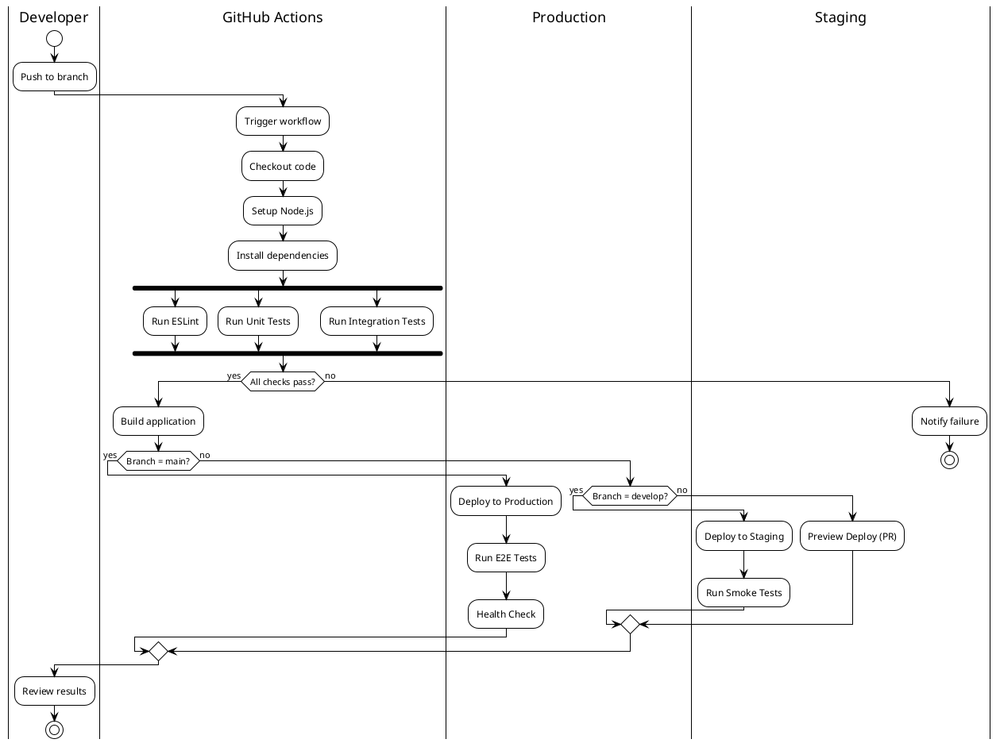

# Integración y Despliegue Continuo (CI/CD)

## Plataforma de Citas Médicas

---

## Índice

1. [Introducción](#1-introducción)
2. [Arquitectura CI/CD](#2-arquitectura-cicd)
3. [Workflow de CI](#3-workflow-de-ci)
4. [Workflow de Despliegue](#4-workflow-de-despliegue)
5. [Configuración de Entornos](#5-configuración-de-entornos)
6. [Estrategia de Branching](#6-estrategia-de-branching)
7. [Automatizaciones](#7-automatizaciones)
8. [Monitoreo y Alertas](#8-monitoreo-y-alertas)
9. [Guía de Troubleshooting](#9-guía-de-troubleshooting)

---

## 1. Introducción

### 1.1 Propósito

Este documento describe la configuración y estrategia de Integración Continua (CI) y Despliegue Continuo (CD) para la Plataforma de Citas Médicas usando GitHub Actions.

**Issues relacionados:** #18, #19, #20, #21

### 1.2 Alcance

La implementación CI/CD cubre:
- Validación automática de código (lint, tests)
- Build automático
- Despliegue a staging y producción
- Monitoreo de calidad

### 1.3 Referencias

| ID | Documento | Descripción |
|---|---|---|
| REF-001 | [03_ARQUITECTURA.md](./03_ARQUITECTURA.md) | Arquitectura del sistema |
| REF-002 | [04_PLAN_PRUEBAS.md](./04_PLAN_PRUEBAS.md) | Plan de pruebas |
| REF-003 | GitHub Actions Docs | Documentación oficial |

---

## 2. Arquitectura CI/CD

### 2.1 Diagrama de Pipeline



### 2.2 Componentes del Pipeline

| Componente | Descripción | Trigger |
|---|---|---|
| CI Pipeline | Lint, test, build | Push, PR |
| Deploy Pipeline | Despliegue automático | Push to main/develop |
| Quality Gate | Validación de calidad | Automático |
| Notifications | Alertas de estado | Siempre |

### 2.3 Tecnologías Utilizadas

| Tecnología | Uso |
|---|---|
| GitHub Actions | Plataforma CI/CD |
| Node.js | Runtime |
| npm | Gestor de paquetes |
| ESLint | Linting |
| Jest | Testing |
| Vercel | Deployment (frontend) |

---

## 3. Workflow de CI

### 3.1 Archivo de Configuración

**Ubicación:** `.github/workflows/ci.yml`

El workflow de CI se ejecuta en cada push y pull request, realizando las siguientes tareas:

1. **Checkout**: Obtiene el código fuente
2. **Setup Node.js**: Configura el entorno de Node.js
3. **Install**: Instala dependencias
4. **Lint**: Ejecuta ESLint para verificar estilo de código
5. **Test**: Ejecuta pruebas unitarias y de integración
6. **Build**: Compila la aplicación

### 3.2 Jobs del CI

| Job | Descripción | Dependencias |
|---|---|---|
| lint | Verificación de código | - |
| test | Ejecución de pruebas | - |
| build | Compilación | lint, test |

### 3.3 Matriz de Compatibilidad

| Node Version | OS | Estado |
|---|---|---|
| 18.x | ubuntu-latest | ✅ Soportado |
| 20.x | ubuntu-latest | ✅ Soportado |

### 3.4 Artefactos Generados

| Artefacto | Descripción | Retención |
|---|---|---|
| coverage-report | Reporte de cobertura | 30 días |
| build-output | Aplicación compilada | 7 días |
| test-results | Resultados de pruebas | 14 días |

---

## 4. Workflow de Despliegue

### 4.1 Archivo de Configuración

**Ubicación:** `.github/workflows/deploy.yml`

El workflow de despliegue se activa cuando hay cambios en las ramas principales.

### 4.2 Estrategia de Despliegue

| Rama | Entorno | Tipo | Aprobación |
|---|---|---|---|
| main | Production | Automático | Requerida |
| develop | Staging | Automático | No requerida |
| feature/* | Preview | Automático (PR) | No requerida |

### 4.3 Pasos del Despliegue

```
1. Build de la aplicación
2. Validación de artefactos
3. Deploy a entorno destino
4. Health check
5. Smoke tests
6. Notificación de resultado
```

### 4.4 Rollback

| Condición | Acción |
|---|---|
| Health check falla | Rollback automático |
| Tests E2E fallan | Rollback manual requerido |
| Error de despliegue | Retry automático (3 intentos) |

---

## 5. Configuración de Entornos

### 5.1 Variables de Entorno

| Variable | Descripción | Secreto |
|---|---|---|
| NODE_ENV | Entorno de ejecución | No |
| MONGODB_URI | URI de conexión MongoDB | Sí |
| JWT_SECRET | Secreto para JWT | Sí |
| VERCEL_TOKEN | Token de Vercel | Sí |

### 5.2 Secrets de GitHub

| Secret | Uso | Entorno |
|---|---|---|
| MONGODB_URI_STAGING | BD de staging | Staging |
| MONGODB_URI_PROD | BD de producción | Production |
| JWT_SECRET | Firma de tokens | Todos |
| VERCEL_TOKEN | Despliegue Vercel | Todos |
| VERCEL_ORG_ID | Organización Vercel | Todos |
| VERCEL_PROJECT_ID | Proyecto Vercel | Todos |

### 5.3 Entornos de GitHub

| Entorno | URL | Protección |
|---|---|---|
| staging | staging.example.com | Ninguna |
| production | app.example.com | Revisores requeridos |

---

## 6. Estrategia de Branching

### 6.1 Modelo de Ramas

```
main (producción)
  │
  ├── develop (staging)
  │     │
  │     ├── feature/auth-system
  │     ├── feature/appointments
  │     └── feature/dashboard
  │
  ├── hotfix/critical-bug
  │
  └── release/v1.0.0
```

### 6.2 Reglas de Protección

| Rama | Regla | Descripción |
|---|---|---|
| main | Require PR | No push directo |
| main | Require reviews | 1 aprobación mínima |
| main | Require status checks | CI debe pasar |
| develop | Require PR | No push directo |
| develop | Require status checks | CI debe pasar |

### 6.3 Flujo de Trabajo

| Acción | Desde | Hacia | Tipo |
|---|---|---|---|
| Nueva feature | develop | feature/* | Branch |
| Completar feature | feature/* | develop | PR |
| Release | develop | main | PR |
| Hotfix | main | hotfix/* | Branch |
| Aplicar hotfix | hotfix/* | main + develop | PR |

---

## 7. Automatizaciones

### 7.1 GitHub Actions Workflows

| Workflow | Archivo | Trigger |
|---|---|---|
| CI | ci.yml | push, PR |
| Deploy | deploy.yml | push main/develop |
| CodeQL | codeql.yml | push, schedule |
| Dependency Review | dependency-review.yml | PR |

### 7.2 Automatizaciones de Proyecto

| Automatización | Trigger | Acción |
|---|---|---|
| Issue asignado | on.assign | Mover a "Ready" |
| PR abierto | on.pr.open | Mover a "In Review" |
| PR merged | on.pr.merge | Mover issue a "Done" |
| Issue cerrado | on.issue.close | Mover a "Done" |

### 7.3 Labels Automáticos

| Condición | Label |
|---|---|
| Cambios en /docs | documentation |
| Cambios en /backend | backend |
| Cambios en /web | frontend |
| Cambios en .github | ci-cd |

---

## 8. Monitoreo y Alertas

### 8.1 Métricas de CI/CD

| Métrica | Objetivo | Alerta |
|---|---|---|
| Build time | <5 min | >10 min |
| Success rate | >95% | <90% |
| Deploy frequency | Daily | <Weekly |
| Lead time | <1 día | >3 días |

### 8.2 Notificaciones

| Evento | Canal | Destinatario |
|---|---|---|
| Build failure | GitHub | PR author |
| Deploy success | GitHub | Team |
| Deploy failure | GitHub | Team + Admin |
| Security alert | GitHub | Admin |

### 8.3 Dashboard de Estado

| Check | Status |
|---|---|
| CI Pipeline |  |
| Deploy |  |
| Coverage | TBD |

---

## 9. Guía de Troubleshooting

### 9.1 Problemas Comunes

#### Build Falla - Dependencias

| Síntoma | Causa | Solución |
|---|---|---|
| npm install falla | Cache corrupto | Limpiar cache: `npm cache clean --force` |
| Module not found | Lock file desactualizado | Regenerar: `rm package-lock.json && npm install` |

#### Tests Fallan

| Síntoma | Causa | Solución |
|---|---|---|
| Tests timeout | DB no conectada | Verificar MONGODB_URI |
| Flaky tests | Estado compartido | Aislar tests, usar beforeEach |

#### Deploy Falla

| Síntoma | Causa | Solución |
|---|---|---|
| Vercel 403 | Token expirado | Regenerar VERCEL_TOKEN |
| Build timeout | Proceso pesado | Aumentar timeout o optimizar |

### 9.2 Logs y Diagnóstico

| Recurso | Ubicación |
|---|---|
| CI Logs | GitHub Actions > Workflow runs |
| Deploy logs | Vercel Dashboard |
| Test reports | Artefactos del workflow |

### 9.3 Contacto de Soporte

| Tipo | Responsable | Contacto |
|---|---|---|
| CI/CD Issues | Bons | GitHub @Bons |
| Infrastructure | Bons | GitHub @Bons |
| Testing | Julio | GitHub @Julio |

---

## Apéndice A: Comandos Útiles

```bash
# Ejecutar CI localmente
npm run lint
npm run test
npm run build

# Verificar estado de workflows
gh workflow list
gh run list

# Ver logs de un run específico
gh run view <run-id> --log

# Re-ejecutar workflow fallido
gh run rerun <run-id>

# Desplegar manualmente
vercel --prod
```

---

## Historial de Versiones

| Versión | Fecha | Autor | Cambios |
|---|---|---|---|
| 1.0 | 2024-XX-XX | Bons | Versión inicial |

---

*Documento de CI/CD para Plataforma de Citas Médicas*
